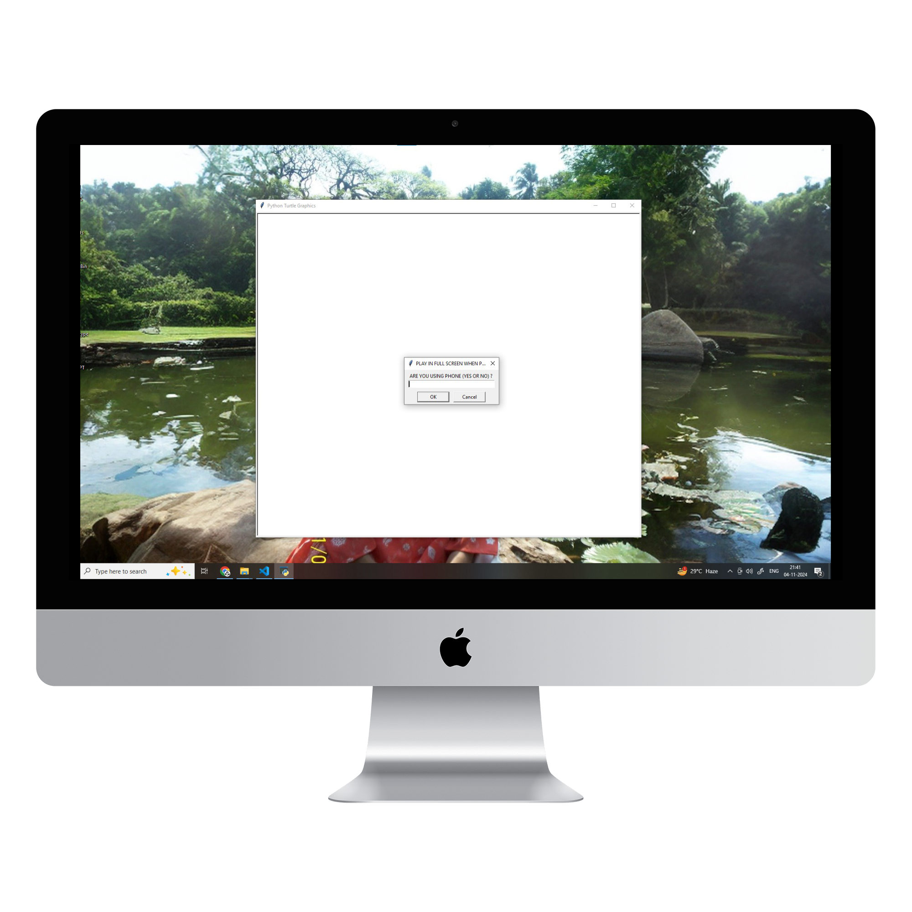

# Snake Game (Python Turtle Graphics)

This is a classic Snake Game developed using Python's `turtle` module. The game can be played on both PC and mobile with adjustments for screen size and controls.

## Features

- **Classic Snake Gameplay**: Control the snake to eat the food and grow longer.
- **PC and Mobile Compatibility**: The game adjusts to different screen sizes and provides on-screen controls for mobile.
- **Score Tracking**: A score counter at the top displays your current score.
- **Game Over Detection**: The game detects collisions with the wall and the snake's body to end the game.

## How to Play

1. **Controls**:
   - On PC: Use the "W", "A", "S", "D" keys to move the snake up, left, down, and right.
   - On Mobile: Tap the on-screen directional buttons to control the snake.
   
2. **Objective**:
   - Guide the snake to eat the food (blue circles) that appear on the screen. Each time the snake eats, it grows longer and your score increases by 1.

3. **Game Over**:
   - The game ends if the snake hits the wall or collides with its own body.

## Setup Instructions

1. **Prerequisites**:
   - Python 3.x is required.
   - The `turtle` module is used (bundled with Python).

2. **Run the Game**:
   - Copy the code from `snake_game.py` and run it in your Python environment.
   - A prompt will ask if you are using a phone. Type "YES" for mobile, or "NO" for PC.

3. **Dependencies**:
   - No additional dependencies are required since this game uses the built-in `turtle` module.

## Code Structure

- **Snake Class**: Handles snake creation, movement, growth, and collision detection.
- **Food Class**: Spawns food randomly on the screen.
- **Score Class**: Displays and updates the player's score.

## Game Parameters

The game dynamically adjusts to different screen sizes based on the device type (PC or Phone). Below are the settings for each device:

### PC Settings

- **Screen Dimensions**: Width = 840, Height = 670
- **Snake Speed**: Moves forward by 25 units per step
- **Score Position**: Positioned at `y = 290`
- **Collision Detection**: Boundary at `x = ±379`, `y = 250` (top), `y = -280` (bottom)

### Phone Settings

- **Screen Dimensions**: Width = 1010, Height = 2000
- **Snake Speed**: Moves forward by 45 units per step
- **Score Position**: Positioned at `y = 1030`
- **Collision Detection**: Boundary at `x = ±490`, `y = 980` (top), `y = -540` (bottom)

## Screenshots

### PC View
- **Loading Screen**  
  

- **Start Screen**  
  

- **Game Screen**  
  

---

Enjoy playing the Snake Game!
